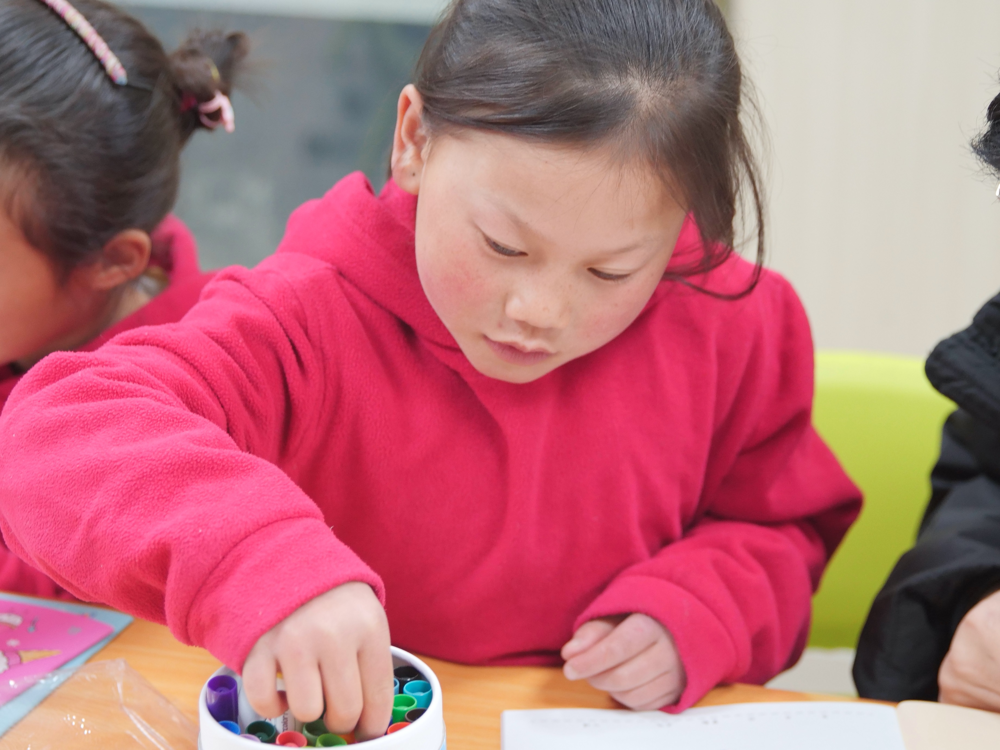
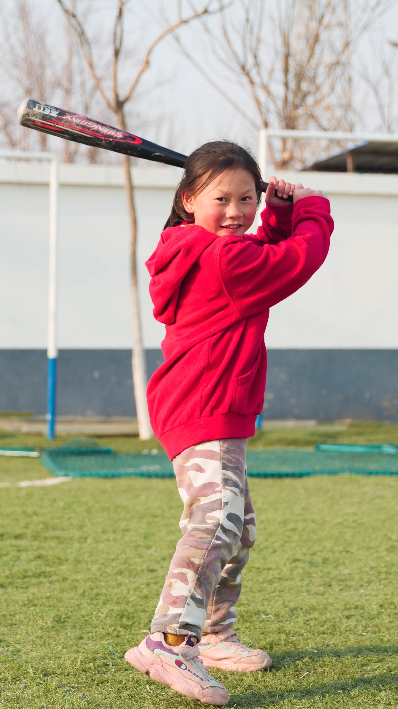
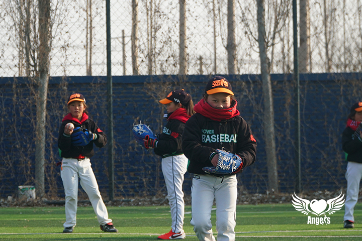
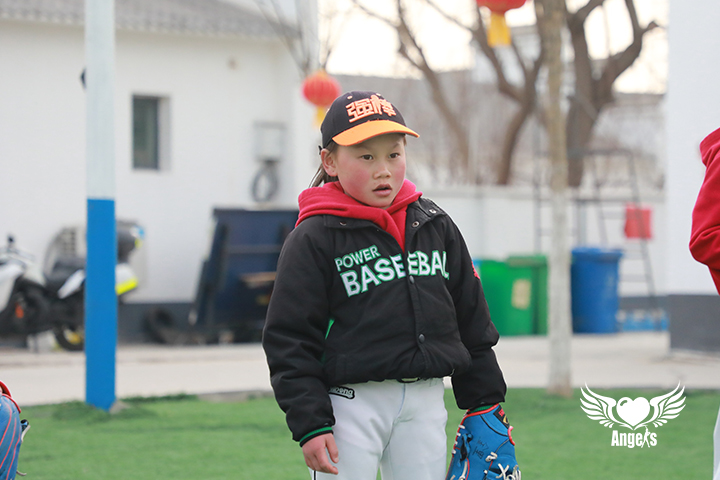
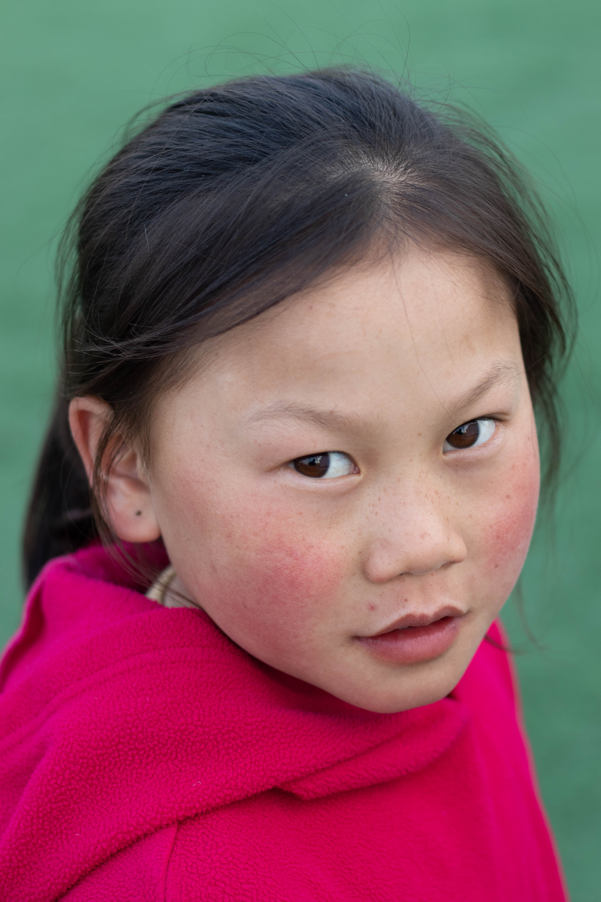

#### 我是海来金里！

hi~我是海来金里，出生于2012.8.17，我是2020年9月加入强棒基地的，我的老家在四川凉山州。

我的外号叫"牛魔王"！因为我常年扎两个"牛角"辫。

我平时很活泼，爱蹦跶，很喜欢笑，也很容易被逗笑。

我半年前开始学习棒球，每天大概训练三个多小时。

> * 我的一天
> * 早晨六点起床，上午学习语文和数学
> * 午饭过后，下午两点左右开始打棒球
> * 晚上六点吃饭，然后组织一起看新闻联播，之后开始写作业，写完作业可以自由活动
> * 九点回房间睡觉，十点熄灯。最喜欢打棒球和看动画片

平时我还爱好跳舞、打棒球、打羽毛球，但我最大的梦想还是成为棒球职业选手！希望这个梦想能够实现！

