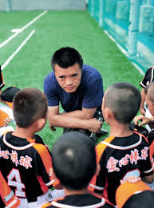
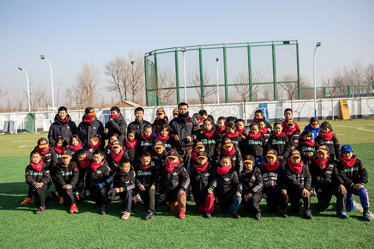
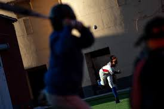

#### 强棒天使项目简介

##### 一、 项目起源
> 棒球是世界最受欢迎的体育运动之一，棒球人才的需求量将越来越大，棒球人才的未来机遇也将前所未有。

每年全球有超过 20 亿的观众观看棒球赛事。棒球世界排名前四的是日本，美国，韩国，中国台湾，所以棒球也是最适合亚洲人的体育运动。目前，中国棒球在世界排名约 20 左右，仍处于起步阶段，具有很大的上升空间，并且在一二线城市已经逐渐被大家所认可。随着棒球产业的不断发展，棒球人才的需求量将越来越大，棒球人才的未来机遇也将前所未有。

项目主要发起人孙岭峰：从 7 岁跟随“国宝级”教练张锦新学习棒球，与棒球相伴 30 余载。曾任国家棒球队队长 15 年，连续三届亚洲盗垒王，国家队第一棒、当家中外野手。棒球是他的生命。

他的成长经历证明了棒球可以改变人生。中国队长的梦想，用棒球给困境中的孩子一个重新选择未来的机会。有一天，他将带着这些孩子一起，让中国棒球得到世界的尊重。

##### 二、项目概述及意义
> 让这些儿童能够有一技之长，得到全面的素质培养，另一方面为中国棒球产业的发展储备并输送大量的人才。
 
“强棒天使项目”紧跟国家“精准扶贫”的公益战略方针，针对 7-9 岁贫困儿童进行全面帮扶。经过多年的专业和系统的棒球训练，完成对孩子未来的职业规划，一方面消除了社会的安全隐患，让这些儿童能够有一技之长，得到全面的素质培养，另一方面为中国棒球产业的发展储备并输送大量的人才。

习近平主席曾经说过：抓好教育是扶贫开发的根本大计，要让贫困家庭的孩子都能接受公平的、有质量的教育，起码学会一项有用的技能，不要让孩子输在起跑线上，尽力阻断贫困代际传递。把贫困地区孩子培养出来，这才是根本的扶贫之策。“授人以鱼不如授人以渔”，强棒天使项目通过长期投入的方式，培养孩子棒球职业能力，在解决基本生活的同时，塑造他们健全、独立的品格，帮助他们实现更高层次的人生目标。

##### 三、项目概况及发展历程
> 5 年来，项目通过与各地政府机构、基层组织、民间团体的合作，走访了全国 300 个家庭，筛选出 80 余名儿童进行资助培训。
 
2015 年 12 月孙岭峰与前中国棒球协会常务副主席李高潮、前中国棒球协会青少年委员会主任张锦新等爱心人士联合发起成立“强棒天使项目”，并在昌平区小汤山建设了“强棒天使爱心棒球基地”，开始创建第一支中国公益棒球队“强棒天使队”。由于拆迁等原因，基地 5 年搬了 4 次家，最终在北京市通州区漷县镇落脚。

“强棒天使项目”主要资助对象为全国范围内 7-9 岁的困境儿童，以集中培训的形式，使被资助者以专业的棒球技能获得职业发展方向和未来的就业机会。5 年来，项目通过与各地政府机构、基层组织、民间团体的合作，走访了全国 300 个家庭，筛选出 80 余名困境儿童进行资助培训。

目前有 68 名困境儿童在北京通州区漷县镇的“强棒天使棒球基地”参加集中培训。他们分别来自全国 9 个地区，包括彝族等 6 个少数民族。其中男孩 42 名，女孩 26 名。年龄最小的 7 岁，最大的 14 岁，少数民族占 75%。“强棒天使队”是一支名副其实的由困境儿童组成的多民族公益棒球队。

##### 四、成材计划

“强棒天使棒球队”将参加各种国内外知名赛事，随着年龄的增长并根据自身发展特点、参与比赛名次及文化学习成绩，队员会进入北京棒球传统校或职业高中进行学习，成绩优秀者还可进入知名大学继续深造。队员成年后，将会利用所学完成职业规划。
* 通过选拔输送到美国 MLB、韩国 KBO、日本 NPB 以及台湾CPBL 等世界顶级职业联盟打球，成为世界级棒球明星。
* 进入中国国家棒球队及各省市专业队参加职业联赛。
* 进入棒球培训体系成为一名棒球培训师，完成职业规划。
