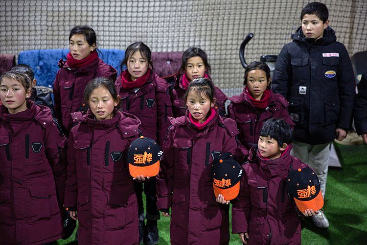
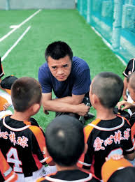

### 棒！少女！“叫板命运”的大凉山女子棒球队

**来源：新京报**

----- 

#### “叫板命运”的棒球少年少女们

“大家好，我叫马虎，今年十二岁。来自十字路口，走丢了，就让爱心棒球基地的人捡到了。谢谢大家。”这几天，一部关于困境儿童通过打棒球改变命运的纪录片《棒！少年》火出了圈，让更多人关注到北京市郊这群“叫板命运”的棒球少年。

纪录片中的爱心棒球基地，即强棒天使棒球基地，由国家棒球队前队长孙岭峰发起，2016年成立。很少有人知道，除了棒球少年，这个基地还有一群来自大凉山的彝族棒球少女。她们一手抓书本，一手抓训练，正为改变自己的命运而努力。

> “从比赛角度来看，女子棒球队打出国际成绩、拿到世界冠军的概率是男子的10倍以上。”

孙岭峰已经立下了一个目标——未来5至10年，让强棒天使棒球队女队取得世界冠军。

目前，基地已经有26个来自大凉山的彝族女孩，孙岭峰口中的“彝族之光”女子棒球队基本组建完毕。刚来基地时完全不懂打棒球的小阿牛，正努力打磨基本功：传接球、接地滚球……现在，她已经是U10(参赛队员需要在10岁以下)女队“战斗力”之一。

> “明年最大的愿望，就是能出去打正式比赛，赢比赛。”小阿牛说。

> “这群女队员的球技有了很大幅度提升，她们的水平已经处于同龄男孩的中上水平了。我觉得快到时候让她们在正式比赛来一场‘首秀’，向全社会亮相了。” 孙岭峰说。
 

在孙岭峰心中，组建女子棒球队不只是打比赛、赢比赛这么简单。

> “从比赛角度来看，在全世界范围内，她们打棒球取得世界冠军的几率比打垒球的几率大得多，而且女子棒球队打出国际成绩、拿到世界冠军的概率是男子的10倍以上。”

> “我们大胆幻想，如果这群女孩子成了世界冠军，对她们自己，对她们的家庭会有多大的影响，这种巨大影响产生的社会价值可能比对她们本人的帮助更大，所以我想组建这样一个女子棒球队。”

孙岭峰想的是，未来5至10年，让强棒天使棒球队女队取得世界冠军。

> “咱们要干，就要一次性干出那些创造历史的事，就是要做出让人意想不到的事，而且是具有绝对社会价值的事。”

#### 棒球队的组建

作为国家棒球队前队长，2009年退役后，孙岭峰从事了不少与棒球相关的工作：担任江苏棒球队总教练、参与运营中国棒球联赛……但这些似乎一直没法“释放他的能量”。同时，他也一直关注慈善公益事业，一直思考以自身的力量能做些什么。摸索了几年后，孙岭峰的两个关注点聚焦在了一起。

2016年年初，孙岭峰和自己的师父、中国棒球协会青少年委员会前主任张锦新等人联合发起了强棒天使棒球基地。

> “跟美国和日本等国相比，棒球在中国还是相对小众，很多人甚至都不知道有这项运动。退役之后，我还是想尽自己最大的力量普及和宣传棒球。”

之所以选择一群特殊的孩子来打棒球，源于孙岭峰十多年前的一次经历。“也是机缘巧合，我参加过针对贫困地区儿童的三个月定向帮扶公益活动，就这样，跟这群孩子结下了‘缘’。我走访过很多边远贫困地区，想通过专业的棒球培训为他们赢得光明的职业前途以及全新的人生，让他们走向世界。”

基地成立之初，孙岭峰找来了7个打棒球的男孩子，随后几年，又零零散散吸收了越来越多的男队员，其中就包括在《棒！少年》中亮相的马虎和小双。

经过四年多的积累，目前，基地一共有68个孩子，包括42名男队员和26名女队员。“现在队员们的分队已经基本稳定了，符合整个棒球的培训体系结构。男队有4个队伍，U15、U12、U10和U8；女队有2个队伍，U12和U10。”

#### 一手捧书本 一手打棒球

为了让孩子们通过棒球走向世界，孙岭峰和基地的教练、工作人员付出了很多努力。

他们每天的作息非常规律：早上6时30分起床，刷牙洗脸、整理个人内务、打扫个人卫生；7时30分，吃早餐，随后打扫公共空间卫生；8时30分-12时，学习文化课；吃完午饭之后，进行简短的午休，13时30分-17时，棒球训练；吃完晚饭后，一小时的晚自习，随后整理好个人内务，21时30分，睡觉。

基地里的孩子，就这样“一手书本，一手棒球”地成长着。

> “我们对于孩子的培养，一直是书本在前、棒球在后，一定是把文化知识放在首位；再就是，第一步是做人，第二步是学习，第三步才是棒球。”孙岭峰说，“非得划分一下比例的话，如果满分是10分的话，做人是4分、学习是3分、棒球是3分。”

之所以将文化课看得如此重，也跟基地培养孩子的目标有关。“孩子们未来的选择是多样的，有的学习很认真，有的在打球上展现出了非凡的天赋，无论他们未来选择在学业上深造，还是打职业棒球，基地都会支持。”棒球教练李祥雨说。

孙岭峰也表示，希望孩子们通过打棒球走得更好，但棒球只是一个教育工具和表现形式，“我更希望给孩子们一套完整的教育体系，让他们变成有用、有爱心、有责任心的人。”

在生活方面，讲礼貌、懂礼节是基地老师对孩子们最基本的要求。

走进爱心棒球基地，无论是教练、老师，还是第一次到访的客人，基地的孩子们都会主动打招呼并鞠躬问好；教练完成训练指导，孩子们会鞠躬感谢；用餐之前，孩子们会一起说“感谢教练”。

> “我一直觉得，人和人之间的交流是要通过礼仪连接到一起的，我对你友善你才会对我友善，这是一个相互的过程。再加上孩子们能够拥有现在的生活，确确实实离不开社会上那么多爱心人士的帮助，他们必须要学会感恩。”孙岭峰说。

生活老师李九令从基地创建之初就开始陪伴这群孩子。在她看来，4年多，孩子们的变化不是“一点半点”，“他们都变得非常有礼貌和懂事，虽然很多孩子都很调皮，但调皮的孩子也是聪明的孩子，每天看着孩子们学习、打球，作为生活老师，我也非常欣慰。”

基地另一个“重头戏”，就是打棒球。

现在，基地共有9名棒球教练，其中一位，是被孩子们称作“师爷”的张锦新。作为我国第二代棒球人，张锦新为国家培养输送了大量的棒球人才，“师爷”的称呼由此而来。

> “我一辈子都在跟棒球‘打交道’，退休之后，接触过基地的这帮孩子，就离不开这里了。”
 
为了带孩子们打棒球，张锦新干脆长期驻扎在基地，两三个月才会回一次家。

张锦新说，来基地的孩子多都处于发育期，因此，适宜的管理方式非常重要，“想让这个年龄段的孩子好好训练，吃得好、睡得饱非常重要，在这个基础上才谈得上让他们打棒球。”

对于孩子们的未来，张锦新一直抱着乐观的态度，“那些身体条件好又想继续打棒球的孩子，从我们这出来打职业比赛应该没什么问题。当然，长大之后到底选择打棒球还是做其他工作，这是他们自己的选择了。”

------ 

**Reference:**

*https://www.chinanews.com/ty/2020/12-17/9364116.shtml*

*https://m.bjnews.com.cn/detail/160803015515606.html*
